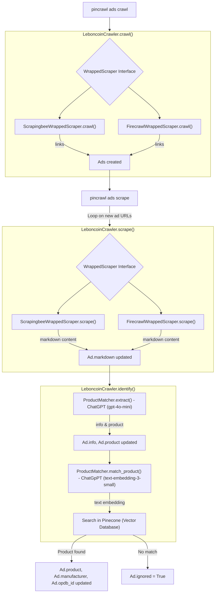

# PinCrawl - Web Crawling Tool

A project for scraping and matching products/ads

## Files
- `docker-compose.yml` – Defines the `app` and `postgres` services
- `requirements.txt` – Dependencies including Click for CLI functionality and PostgreSQL support
- `cli.py` – Main CLI application with `pincrawl` command
- `database.py` – PostgreSQL database models and connection management
- `.dockerignore` – Keeps build context lean

## Quick Start

Setup environment variables:
```bash
cp .env.dist .env
# Edit .env and add your API keys (Firecrawl, OpenAI, Pinecone)
```

Start the console:
```bash
docker-compose run --rm console bash
pip install -e .
```

Show help:
```bash
pincrawl --help
```

Run a crawling task to discover ads:
```bash
pincrawl -vvv ads crawl
```

Scrape detailed information from discovered ads:
```bash
pincrawl -vvv ads scrape
```

Display price statistics (read-only):
```bash
pincrawl ads stats
```

Display and save statistics:
```bash
pincrawl ads stats --save
```

Send email notifications to watchers:
```bash
pincrawl watching send-email
```

Send push notifications to watchers:
```bash
pincrawl watching send-push
```

Send both email and push notifications:
```bash
pincrawl watching send
```

## Crawling architecture



[mermaid](https://mermaid.live/edit#pako:eNqFU2tv2jAU_StX_jBRiSBCeCXSJrWlb7ailW3SSFWZ-ALWiB0ZR5QR_vtuHArrumn5kDjX55x7jh9blmiBLGJzw7MFjAexAnpOJ5lUieHrJXCxghUNM3wEz_tQDLXOQCtQuKY5-PJ5uCrgbBKzIU61SrRU5yUPTaNi1U5i9lipnpUCg-03KmcoHty0gRtl0cx4grsKNXBt7jMrqYtfwAVpO6xU8ynia_bbJq_orQIuiX4pDbo0_yNfOHLKzQ-h1woSTd6ULeBqcioah3KeCW5R7DmX_-JU09X7qgRd_22VpCC0nG1-c3Fdgm8IPDJa5In9yG2yICg-W8MTWzsBD84X3F6NxlCbZ9Zray-VSh4VbpwnqWYa3kFWqUABt2WMsloHGrzUX8e5ddT9XAF3b22k5fdpjziayUo3ljx6mE5RCNouL_BWKV8uj8bunHqJggOqgGG5xchNsgCpYCQV0ioi1L5iYrWBAbd8yldYyVRCQyfkLMFM50oUcD85hnIBU65yOlg2N2hcQWdi-iTFH4krqU8aXLACRm6V5kobFPAexibHPZLVWYom5VLQjdmWtZjZBaYYs4iGgs5AzGK1IxzPrX7YqIRFlvh1ZnQ-X7Boxpcr-qsMDCSna5ceqhlX37VOXyhzU_bZ01EJNOcU1LLI7_RDh2bRlj2zqOX7jY7fbPaDrh82u61mu842LPLazbDRbAd-K_SDoBP0ut1dnf10HfxGL_TDIOiHbb_TI2Bv9wvUzU8M)

### Scraper tests

[Google Spreadsheet](https://docs.google.com/spreadsheets/d/1RwU22F-7vSGs6U7GK_Y8ErwHb0KtvjNY2s9GCLt56r0/edit?gid=0#gid=0)
[Google App Script](https://script.google.com/home/projects/1878ZofwiOrf0KS2PIXvEiExq4EISkh9WopYFNYraCZgtAee6G9XVHQ_P/edit?hl=fr)

## Testing Push Notifications

To test push notifications for a logged-in user, you can use the test endpoint:

```bash
# Replace 'en' with your locale and ensure you're authenticated in the browser first
curl -X POST "http://localhost:8000/test-push-notification" \
  -H "Content-Type: application/json" \
  -H "Cookie: session=your_session_cookie_here"
```

Note: You need to be logged in and have push notifications enabled in your account settings for this to work.

## Cronjobs

First cronjob runs every 5minutes between 8o am and midnight (utc+2):

```
*/5 6-23 * * * pincrawl crawl >> /var/log/pincrawl.log 2>&1
```

Second cronjob runs every 5minutes between 8o am and midnight (utc+2), but 2min after:

```
2-59/5 6-23 * * * pincrawl scrape >> /var/log/pincrawl.log 2>&1
```

Third cronjob runs every 5minutes between 8o am and midnight (utc+2), but 2min after:

```
4-59/5 6-23 * * * pincrawl subs send >> /var/log/pincrawl.log 2>&1
```

Fourth cronjob runs every night:

```
0 2 * * * pincrawl ads stats --save >> /var/log/pincrawl.log 2>&1
```

## Translations

The project uses a shared translation directory at the root level (`/translations/`) for both the website and CLI/email services.

### Update translation strings:
```bash
pybabel extract -F babel.cfg -o new.po . && pybabel update -i new.po -d translations && rm new.po
```

### Compile all translation files:
```bash
pybabel compile -d translations
```

Translation files are located in:
- `translations/en/LC_MESSAGES/messages.po` (English)
- `translations/fr/LC_MESSAGES/messages.po` (French)

## local https server to test on phone

```
# Install localtunnel globally
sudo npm install -g localtunnel

# Expose your FastAPI app running in Docker
lt --port 8080 --subdomain pincrawl
```

## Notifications on Android

For best notification experience on Android Chrome:
1. Enable notifications for this site in Chrome
2. Go to Android Settings → Apps → Chrome → Notifications
3. Enable "Pop on screen" or "Show notifications"
4. Make sure "Do Not Disturb" is not blocking notifications

Désactiver l’optimisation de batterie pour Chrome / ton navigateur
Sur Android :

Paramètres > Applications > Chrome > Batterie > Utilisation en arrière-plan = Autoriser
et
Paramètres > Batterie > Optimisation → Chrome → Ne pas optimiser

Ce point résout 80 % des problèmes.

Pour une PWA installée via Chrome :
désactiver l’optimisation pour Chrome, pas pour la PWA.


## TODO

### Must

- [ ] switch to a cheaper scraper like https://dashboard.decodo.com/
- [ ] main.py: switch user id to uuid
- [ ] main.py: link a user with its auth0 id, not his email
- [ ] OPEN TO THE WORLD
  - [ ] switch to a dedicated domain
  - [ ] auth0: passer en mode prod
  - [ ] setup stripe?
- [ ] améliorer le moteur de recherche (typo, ...)
- [ ] my-account: add a link to /plans on "Not included in your plan" on my-account.html

### Should

- [ ] translate push notifications
- [ ] send same notifications with onesignal to everyone at the same time  (remote_ids)
- [ ] inject user and account with a middleware in all routes & template
- [ ] tracker le dernier prix et la suppression d'une annonce
- [ ] admin interface to see all scraped ads
- [ ] as a user, declare an alert as invalid (will ask for a manual review)
- [ ] leboncoin_crawler: Enhance leboncoin search with typo (fliper, filpper)
- [ ] pinballs.html: Price history only for Collector and Pro
- [ ] pinballs.html: thumbnails for pinball
- [ ] translate svg/png price graph
- [ ] créer une tâche d'envoi par destinaire pour pouvoir rejouer en cas de plantage

### Could

- [ ] all last ads in "my event" page
- [ ] display stats on home page: number of ads scraped / month, number of alerts ?
- [ ] use internal id of product as a foreign key in Watching instead of opdb_id. will allow to have graph with graphs/[internal-product-id}.svg instead of graphs/GrqL6-MLy7l.svg
  - [ ] main:watch(): check opdb_id when creating a Watching
- [ ] email_notification.html: pink dot for current ad price in graph
- [ ] graph_utils.py: rework to make a class GraphService
- [ ] push: Ad images in push notification
- [ ] push: Ad images in email
- [ ] pincrawl watching send: add a parameter --since to send everything from a date (debug)
- [ ] base.html: one file + use a binding framework
- [ ] _header: active menu item in header depending on current page
- [ ] base.html: rename base.html to _base.html?
- [ ] Add other ads providers: ebay, ouest france
- [ ] unwatch pinball from email
- [ ] pincrawl scrape: download images and visit archive (or do a screenshot)
- [ ] better logo

### Done

- [X] main:watch() shoud respond a JsonResponse
- [X] base.html: cdn.tailwindcss.com should not be used in production
- [X] EPIC: link ads finding back previous seller & seller URL (from stored ads) and rework graph to see price progress on one product
  - [X] track seller_url
  - [X] complete seller and seller_url from stored ads
- [X] pincrawl ads: Accelerate cron running everything in one
- [X] Web Push API POC
- [X] push: make notifications works with more than 1 notification
- [X] what happen if I subscribe on a browser and I need notification on another browser => Info message
- [X] rework send_ad_notification_email() to not build a ad_data dictionnary and directly pass "ads" var
- [X] main:update_my_account() shoud respond a JsonResponse
- [X] sauvegarder le vendeur
- [X] CGU
- [X] setup mailersend
- [X] rename page /pricing to /plans
- [X] add a bcc mailcatcher to all sent mails
- [X] remove validate_locale everywhere
- [X] use internal id of the user as a foreign key in Watching entity instead of email
- [X] traduire le mail en FR (email template now supports EN/FR translation)
- [X] limit number of subscriptions to 3 / user
- [X] mentions legales
- [X] custom domain pincrawl.pitp.it

## 3rd party tools

* https://app.mailersend.com/dashboard
* https://dashboard.render.com/
* https://platform.openai.com/
* https://www.firecrawl.dev/app/logs
* https://app.pinecone.io/